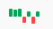

The jQuery sparkline assets and widget for Yii2.

Installation
------------

The preferred way to install this extension is through [composer](http://getcomposer.org/download/).

Either run

```
php composer.phar require --prefer-dist machour/yii2-sparkline "*"
```

or add

```
"machour/yii2-sparkline": "*"
```

to the require section of your `composer.json` file.


Usage
-----

Once the extension is installed, use the widget this way:

```php
<?= \machour\sparkline\Sparkline::widget([
    'clientOptions' => [
        'type' => 'bar', 
        'height' => 20, 
        'barColor' => '#00a65a',
    ],
    'data' => [90, 80, 90, -70, 61, -83, 63]
]); ?>
```

This would produce the following sparkline: 

This documentation is available [online](http://machour.idk.tn/yii/machour/yii2-sparkline)
